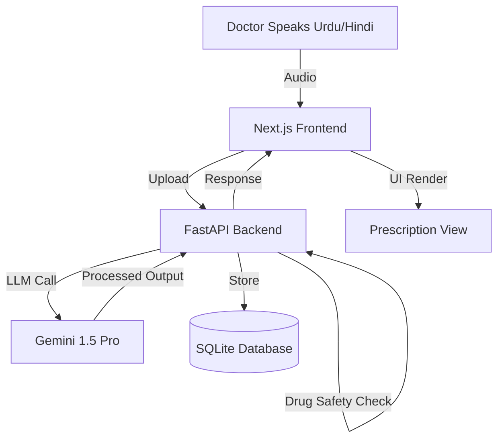

# 🩺 PulseScriptAI  
### Intelligent Medical Scribe & Clinical Safety Assistant


> **Bridging the gap between a doctor’s voice and digital medical records.**  
> PulseScriptAI converts real-world multilingual consultations (Urdu / Hindi / English) into structured, professional clinical notes and prescriptions — with built-in patient safety checks.

---

## 🚨 The Problem

In high-volume clinics across South Asia (Pakistan & India), doctors face serious operational and safety challenges:

1. **Language Mismatch**  
   Patients speak Urdu, Hindi, or Hinglish — but medical records must be written in formal English.

2. **Manual Data Entry**  
   Typing prescriptions wastes time and reduces doctor–patient interaction.

3. **Medication Safety Risks**  
   Drug-Drug Interaction checks are often skipped due to time pressure, leading to preventable medical errors.

---

## 💡 The Solution — PulseScriptAI

**PulseScriptAI is not just a transcriber.**  
It is an **AI clinical assistant** that understands conversation context, removes irrelevant speech, translates medical meaning, structures prescriptions, and actively warns about unsafe drug combinations.

---

## 🌟 Key Features

| Feature | Description |
|------|------------|
| 🎙️ **Multilingual Audio Understanding** | Handles mixed **Urdu, Hindi, Hinglish & English** seamlessly |
| 🧠 **Medical Context Translation** | Converts local terms like *“Bukhar”* → **Fever**, *“Saans ki takleef”* → **Dyspnea** |
| 🛡️ **AI Drug Safety Guard** | **Automatically detects Drug-Drug Interactions before finalizing prescription** |
| 💊 **Structured Prescription Output** | Medication name, dosage, frequency & duration in clean JSON |
| 📂 **Patient History Tracking** | Secure storage & retrieval of past consultations |
| ⚡ **Low-Latency Processing** | Powered by **Google Gemini 1.5 Pro** |

---

## 📸 Application Preview

| Doctor Dashboard | Real-Time Prescription Analysis |
|---|---|
|  |  |

---

## 🛠️ Tech Stack

### Frontend
- **Framework:** Next.js 14 (App Router)
- **Styling:** Tailwind CSS
- **Icons:** Lucide React
- **State Management:** React Hooks & Context API

### Backend
- **Framework:** FastAPI (Python)
- **Server:** Uvicorn
- **Database:** SQLite (SQLAlchemy ORM)
- **Authentication:** JWT (OAuth2)

### Artificial Intelligence
- **LLM:** Google Gemini 1.5 Pro
- **Technique:** System Prompting for
  - Medical translation
  - Clinical summarization
  - JSON extraction
  - Safety rule enforcement

---

## ⚙️ Installation & Local Setup

### 1️⃣ Clone Repository
```bash
git clone https://github.com/MoizAli3/mediscribe.git
cd mediscribe
```
### 2️⃣ Backend Setup (FastAPI)
cd backend

##### Create virtual environment
```
python -m venv venv

# Activate (Windows)
venv\Scripts\activate

# Activate (Linux / macOS)
source venv/bin/activate

# Install dependencies
pip install fastapi uvicorn sqlalchemy google-generativeai python-dotenv python-multipart python-jose[cryptography] passlib[bcrypt]

# Run server
uvicorn main:app --reload
```

###### 🔑 Environment Variables
Create a .env file inside /backend:
```
GEMINI_API_KEY=your_api_key_here
```
### 3️⃣ Frontend Setup (Next.js)
Open a new terminal:
```
cd frontend

npm install
npm run dev
```
### 4️⃣ Access the Application
```
http://localhost:3000
```

## 🧠 System Architecture


# 🤝 Contributors

- **Moiz Ali** — Backend Architecture, Frontend & AI Logic  
- **Hamza Naseem** — Backend  Engineering & Agentic AI Framework 
